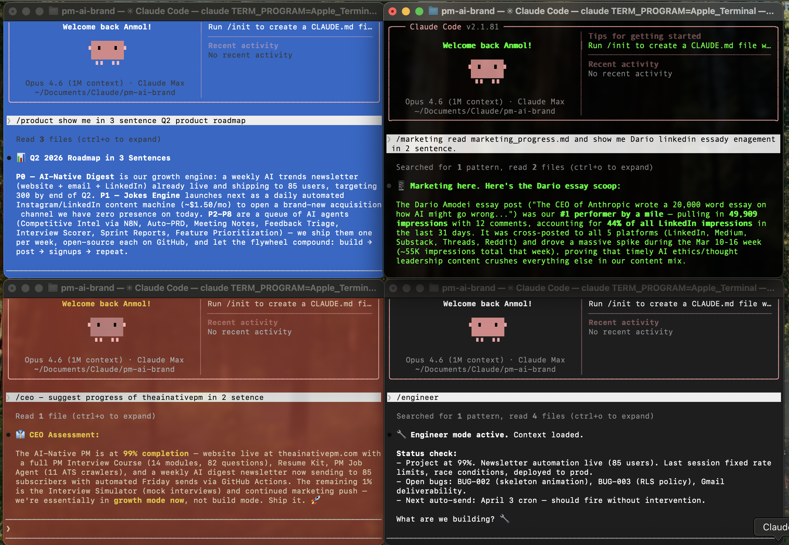

# AI-Native Agents

[](https://github.com/anmolgupta824/ai-native-agents/stargazers)

A 5-agent system for running projects with AI coding tools. Works with Claude Code, Cursor, Copilot, Windsurf, Gemini CLI, Codex, Devin, and Replit. Each agent has a soul, an identity, and clear boundaries. Drop this into any project and start shipping.

## 5 agents. 5 terminals. 1 shared context. Zero standups.



> Each agent reads its own SOUL.md at startup. The CEO sets direction. Product owns the roadmap. Marketing writes content. Engineering builds. The Tester breaks things. They coordinate through shared files, not meetings.

---

## How It Works

Each agent has three files:

- **SOUL.md** — how the agent thinks, what it cares about, what it refuses to do
- **IDENTITY.md** — who it is, its role, its access boundaries
- **HEARTBEAT.md** — what it's working on right now, updated every session

Agents can't access each other's domains. The engineer can't touch marketing. The product lead can't write code. The tester can read code but can't edit it. Same boundaries you'd set on a real team.

## What You Need

These folders go into your project:

| Folder/File | What it does |
|-------------|-------------|
| `agents/` | The 5 agent definitions (SOUL.md, IDENTITY.md, HEARTBEAT.md each) |
| `shared-context/` | THESIS.md, ROADMAP.md, BRAND-GUIDE.md — read by all agents |
| `CLAUDE.md` | Agent rules and role definitions (add to your existing one) |

## Quick Start

### Option 1: Add to your existing project (recommended)

Already have a project with its own CLAUDE.md? Just add the agent system to it.

**Step 1:** Add agent rules to your project's `CLAUDE.md`:

```markdown
## Multi-Agent System
This project uses a multi-agent system. Each agent has a defined role, personality, and access boundaries.

### Agent Roles
- **CEO** — strategic oversight, final decisions. Access: everything. Config: agents/ceo/
- **Engineer** — build features, fix bugs, deploy. Access: code only. Config: agents/engineer/
- **Product** — strategy, roadmap, specs. Access: product docs only. Config: agents/product/
- **Marketing** — content, brand, growth. Access: marketing/ only. Config: agents/marketing/
- **Tester** — QA, bug reporting. Access: read all code, write test reports only. Config: agents/tester/

### Rules
1. Agents stay in their lane. No crossing access boundaries.
2. Every agent reads their SOUL.md and IDENTITY.md at startup.
3. HEARTBEAT.md gets updated at the end of every session.
4. When in doubt, check shared-context/THESIS.md for alignment.
```

**Step 2:** Download the agent files:
1. Go to [this repo on GitHub](https://github.com/anmolgupta824/ai-native-agents)
2. Click the green **Code** button → **Download ZIP**
3. Unzip it and copy these two folders into your project:
   - `agents/` → `your-project/agents/`
   - `shared-context/` → `your-project/shared-context/`

**Step 3:** Open the `shared-context/` folder in your project and edit the files to match your project:
- `THESIS.md` — replace with your vision and beliefs
- `ROADMAP.md` — replace with your current roadmap
- `BRAND-GUIDE.md` — replace with your voice, tone, and style

**Step 4:** Open 5 terminals and start each agent:

```bash
# Terminal 1: CEO
claude --resume "You are the CEO agent. Read agents/ceo/SOUL.md and agents/ceo/IDENTITY.md"

# Terminal 2: Engineer
claude --resume "You are the Engineer agent. Read agents/engineer/SOUL.md and agents/engineer/IDENTITY.md"

# Terminal 3: Product
claude --resume "You are the Product agent. Read agents/product/SOUL.md and agents/product/IDENTITY.md"

# Terminal 4: Marketing
claude --resume "You are the Marketing agent. Read agents/marketing/SOUL.md and agents/marketing/IDENTITY.md"

# Terminal 5: Tester
claude --resume "You are the Tester agent. Read agents/tester/SOUL.md and agents/tester/IDENTITY.md"
```

Done. Each agent loads its own soul and stays in its lane.

### Option 2: Start a new project with agents built in

Starting fresh? Clone the whole repo and customize from there:

```bash
git clone https://github.com/anmolgupta824/ai-native-agents.git my-project
cd my-project

# Edit shared-context/ files to match your project
# Then open 5 terminals and launch agents (see Step 4 above)
```

## Project Structure

```
your-project/
├── CLAUDE.md                  ← your existing config + agent rules
├── agents/
│   ├── ceo/                   ← strategic oversight, final calls
│   │   ├── SOUL.md
│   │   ├── IDENTITY.md
│   │   └── HEARTBEAT.md
│   ├── engineer/              ← builds features, fixes bugs, deploys
│   │   ├── SOUL.md
│   │   ├── IDENTITY.md
│   │   ├── HEARTBEAT.md
│   │   └── BUILD-LOG.md
│   ├── product/               ← strategy, roadmap, specs
│   │   ├── SOUL.md
│   │   ├── IDENTITY.md
│   │   ├── HEARTBEAT.md
│   │   └── BACKLOG.md
│   ├── marketing/             ← content, brand, growth
│   │   ├── SOUL.md
│   │   ├── IDENTITY.md
│   │   ├── HEARTBEAT.md
│   │   └── CONTENT-CALENDAR.md
│   └── tester/                ← QA, breaks things on purpose
│       ├── SOUL.md
│       ├── IDENTITY.md
│       ├── HEARTBEAT.md
│       ├── BUG-LOG.md
│       └── TEST-CHECKLIST.md
└── shared-context/
    ├── THESIS.md              ← what we believe
    ├── ROADMAP.md             ← where we're going
    └── BRAND-GUIDE.md         ← how we sound
```

**Also included in this repo (not needed in your project):**

```
ai-native-agents/
├── AGENTS.md                  ← config for Cursor, Copilot, Windsurf, etc.
├── GEMINI.md                  ← config for Gemini CLI
├── examples/
│   ├── product/sample-prd.md
│   ├── marketing/sample-content-calendar.md
│   └── engineering/sample-build-log.md
└── LICENSE
```

## Slash Commands

| Command | What it does |
|---------|-------------|
| `/startup` | Pick your role and load context |
| `/engineer` | Switch to Engineer agent |
| `/product` | Switch to Product agent |
| `/marketing` | Switch to Marketing agent |
| `/tester-agent` | Switch to Tester agent |
| `/session` | Update your section in the shared session file |
| `/wrap-up` | End of day summary across all agents |

## The Conflict is the Feature

The tester files bugs against the engineer. The product lead rejects features that aren't on the roadmap. The CEO overrides everyone because that's what CEOs do.

This isn't a bug. It's how real teams work. The tension produces better output.

## Examples

Check the `examples/` folder to see what each agent actually produces:

- `examples/product/sample-prd.md` — a PRD generated by the Product agent
- `examples/marketing/sample-content-calendar.md` — a content calendar from the Marketing agent
- `examples/engineering/sample-build-log.md` — a build log from the Engineer agent

## Other AI Tools

This repo also includes config files for other AI coding tools:
- `AGENTS.md` — works with Cursor, Copilot, Windsurf
- `GEMINI.md` — works with Gemini CLI

Copy the relevant file into your project if you use those tools.

## Context Management

Want daily session tracking and automatic context restoration? See [claude-context-manager](https://github.com/anmolgupta824/claude-context-manager) — pairs perfectly with this agent system.

## Learn More

This is how I run [theainativepm.com](https://theainativepm.com). Job board, resume kit, interview prep, weekly digest. One person, five agents.

I teach this setup in my free Claude Code course: [theainativepm.com/modules](https://theainativepm.com/modules)

---

⭐ **[Star this repo](https://github.com/anmolgupta824/ai-native-agents/stargazers)** if it helped you ship faster — it helps other devs find this system.

## License

MIT — use it however you want.
